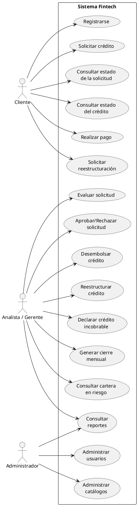
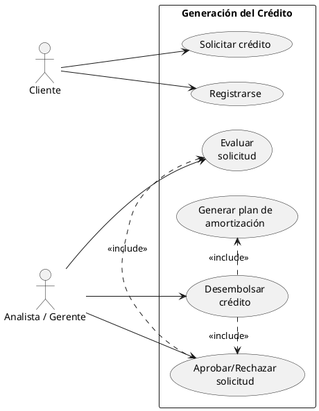
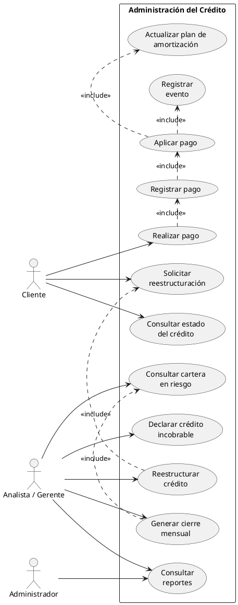

# CU-01 General

## Código PlantUML

```plantuml
@startuml
left to right direction
skinparam packageStyle rectangle
skinparam shadowing false

actor Cliente
actor "Analista / Gerente" as Analista
actor Administrador

rectangle "Sistema Fintech" {

  usecase "Registrarse" as UC1
  usecase "Solicitar crédito" as UC2
  usecase "Consultar estado\nde la solicitud" as UC3
  usecase "Consultar estado\ndel crédito" as UC4
  usecase "Realizar pago" as UC5
  usecase "Solicitar\nreestructuración" as UC6

  usecase "Evaluar solicitud" as UC7
  usecase "Aprobar/Rechazar\nsolicitud" as UC8
  usecase "Desembolsar\ncrédito" as UC9
  usecase "Reestructurar\ncrédito" as UC10
  usecase "Declarar crédito\nincobrable" as UC11
  usecase "Generar cierre\nmensual" as UC12
  usecase "Consultar cartera\nen riesgo" as UC13
  usecase "Consultar\nreportes" as UC14

  usecase "Administrar\nusuarios" as UC15
  usecase "Administrar\ncatálogos" as UC16
}

Cliente --> UC1
Cliente --> UC2
Cliente --> UC3
Cliente --> UC4
Cliente --> UC5
Cliente --> UC6

Analista --> UC7
Analista --> UC8
Analista --> UC9
Analista --> UC10
Analista --> UC11
Analista --> UC12
Analista --> UC13
Analista --> UC14

Administrador --> UC14
Administrador --> UC15
Administrador --> UC16

@enduml
```

## Resultado

# CU-02 Generación de Crédito

## Código PlantUML

```plantuml
@startuml
left to right direction
skinparam packageStyle rectangle
skinparam shadowing false

actor Cliente
actor "Analista / Gerente" as Analista

rectangle "Generación del Crédito" {

  usecase "Registrarse" as UC1
  usecase "Solicitar crédito" as UC2

  usecase "Evaluar\nsolicitud" as UC3

  usecase "Aprobar/Rechazar\nsolicitud" as UC4

  usecase "Desembolsar\ncrédito" as UC5

  usecase "Generar plan de\namortización" as UC6

}

Cliente --> UC1
Cliente --> UC2

Analista --> UC3
Analista --> UC4
Analista --> UC5

UC4 .> UC3 : <<include>>

UC5 .> UC4 : <<include>>

UC5 .> UC6 : <<include>>

@enduml
```
## Resultado

# CU-02 Administración del Crédito

## Código PlantUML

```plantuml
@startuml
left to right direction
skinparam packageStyle rectangle
skinparam shadowing false

actor Cliente
actor "Analista / Gerente" as Analista
actor Administrador

rectangle "Administración del Crédito" {

  usecase "Consultar estado\ndel crédito" as UC1

  usecase "Realizar pago" as UC2
  usecase "Registrar pago" as UC3
  usecase "Aplicar pago" as UC4
  usecase "Actualizar plan de\namortización" as UC5
  usecase "Registrar\nevento" as UC6

  usecase "Solicitar\nreestructuración" as UC7
  usecase "Reestructurar\ncrédito" as UC8

  usecase "Declarar crédito\nincobrable" as UC9

  usecase "Generar cierre\nmensual" as UC10

  usecase "Consultar cartera\nen riesgo" as UC11

  usecase "Consultar\nreportes" as UC12

}

Cliente --> UC1
Cliente --> UC2
Cliente --> UC7

Analista --> UC8
Analista --> UC9
Analista --> UC10
Analista --> UC11
Analista --> UC12

Administrador --> UC12

UC2 .> UC3 : <<include>>
UC3 .> UC4 : <<include>>
UC4 .> UC5 : <<include>>
UC4 .> UC6 : <<include>>

UC8 .> UC7 : <<include>>

UC10 .> UC11 : <<include>>

@enduml
```
## Resultado

