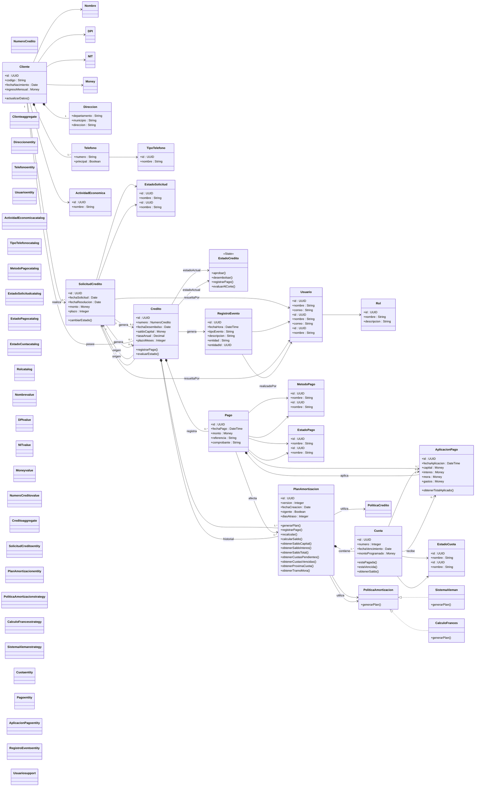

```mermaid
classDiagram
direction LR

%%=========================
%% ESTILOS
%%=========================

classDef aggregate fill:#D6EAF8,stroke:#2E86C1,stroke-width:2px
classDef entity fill:#D5F5E3,stroke:#239B56,stroke-width:2px
classDef catalog fill:#FCF3CF,stroke:#D4AC0D,stroke-width:2px
classDef value fill:#EBDEF0,stroke:#8E44AD,stroke-width:2px
classDef support fill:#EAECEE,stroke:#5D6D7E,stroke-width:2px

%%=========================
%% VALUE OBJECTS
%%=========================

class Nombre {
}

class DPI {
}

class NIT {
}

class Money {
}

class NumeroCredito {
}

%%=========================
%% CLIENTE
%%=========================

class Cliente {
    +id : UUID
    +codigo : String
    +fechaNacimiento : Date
    +ingresoMensual : Money

    +actualizarDatos()
}

class Direccion {
    +departamento : String
    +municipio : String
    +direccion : String
}

class Telefono {
    +numero : String
    +principal : Boolean
}

%%=========================
%% SEGURIDAD
%%=========================

class Usuario{
    +id : UUID
    +nombre : String
    +correo : String
}

%%=========================
%% CATALOGOS
%%=========================

class Rol{
    +id : UUID
    +nombre : String
    +descripcion : String
}

class ActividadEconomica{
    +id : UUID
    +nombre : String
}

class TipoTelefono{
    +id : UUID
    +nombre : String
}

class MetodoPago{
    +id : UUID
    +nombre : String
}

class EstadoSolicitud{
    +id : UUID
    +nombre : String
}

class EstadoCredito{
    <<State>>
    +aprobar()
    +desembolsar()
    +registrarPago()
    +evaluarAlCorte()
}

class EstadoPago{
    +id : UUID
    +nombre : String
}

class EstadoCuota{
    +id : UUID
    +nombre : String
}

%%=========================
%% RELACIONES
%%=========================

Cliente *-- "1" Direccion

Cliente *-- "1..*" Telefono

Telefono --> TipoTelefono

Cliente --> ActividadEconomica

Usuario --> Rol

Cliente --> Nombre

Cliente --> DPI

Cliente --> NIT

Cliente --> Money

%%=========================
%% ESTILOS
%%=========================

class Cliente aggregate

class Direccion entity
class Telefono entity
class Usuario entity

class ActividadEconomica catalog
class TipoTelefono catalog
class MetodoPago catalog
class EstadoSolicitud catalog
class EstadoCredito
class EstadoPago catalog
class EstadoCuota catalog
class Rol catalog

class Nombre value
class DPI value
class NIT value
class Money value
class NumeroCredito value
%%==================================================
%% ESTILOS
%%==================================================
classDef aggregate fill:#D6EAF8,stroke:#2E86C1,stroke-width:2px
classDef entity fill:#D5F5E3,stroke:#239B56,stroke-width:2px
classDef catalog fill:#FCF3CF,stroke:#D4AC0D,stroke-width:2px
classDef strategy fill:#FAD7A0,stroke:#CA6F1E,stroke-width:2px
classDef value fill:#EBDEF0,stroke:#8E44AD,stroke-width:2px
%%==================================================
%% VALUE OBJECT
%%==================================================

class Money
class NumeroCredito

%%==================================================
%% CATALOGOS
%%==================================================

class EstadoSolicitud{
    +id : UUID
    +nombre : String
}

%%==================================================
%% SEGURIDAD
%%==================================================

class Usuario{
    +id : UUID
    +nombre : String
    +correo : String
}

%%==================================================
%% DOMINIO
%%==================================================

class SolicitudCredito{
    +id : UUID
    +fechaSolicitud : Date
    +fechaResolucion : Date
    +monto : Money
    +plazo : Integer

    +cambiarEstado()
}

class Credito{
    +id : UUID
    +numero : NumeroCredito
    +fechaDesembolso : Date

    +saldoCapital : Money
    +tasaAnual : Decimal
    +plazoMeses : Integer

    +registrarPago()
    +evaluarEstado()
}

class PlanAmortizacion{
    +id : UUID
    +version : Integer
    +fechaCreacion : Date
    +vigente : Boolean
    +diasAtraso : Integer

    +generarPlan()
    +registrarPago()
    +recalcular()
    +calcularSaldo()
    +obtenerSaldoCapital()
    +obtenerSaldoInteres()
    +obtenerSaldoTotal()
    +obtenerCuotasPendientes()
    +obtenerCuotasVencidas()
    +obtenerProximaCuota()
    +obtenerTramoMora()
}

%%==================================================
%% STRATEGY
%%==================================================

class PoliticaAmortizacion{
    +generarPlan()
}

class CalculoFrances{
    +generarPlan()
}

class SistemaAleman{
    +generarPlan()
}

%%==================================================
%% RELACIONES
%%==================================================

SolicitudCredito --> EstadoSolicitud

SolicitudCredito --> Usuario : resueltaPor

SolicitudCredito "1" --> "0..1" Credito : genera

Credito --> SolicitudCredito : origen

Credito --> EstadoCredito : estadoActual

Credito *-- "1..*" PlanAmortizacion

PlanAmortizacion --> PoliticaAmortizacion

PoliticaAmortizacion <|.. CalculoFrances

PoliticaAmortizacion <|.. SistemaAleman

Pago --> PlanAmortizacion : afecta

%%==================================================
%% COLORES
%%==================================================

class Credito aggregate

class SolicitudCredito entity
class PlanAmortizacion entity
class Usuario entity

class EstadoSolicitud catalog
class EstadoCredito

class PoliticaAmortizacion strategy
class CalculoFrances strategy
class SistemaAleman strategy

class Money value
class NumeroCredito value

%%==================================================
%% ESTILOS
%%==================================================

classDef entity fill:#D5F5E3,stroke:#239B56,stroke-width:2px
classDef catalog fill:#FCF3CF,stroke:#D4AC0D,stroke-width:2px
classDef support fill:#EAECEE,stroke:#5D6D7E,stroke-width:2px
classDef value fill:#EBDEF0,stroke:#8E44AD,stroke-width:2px

%%==================================================
%% VALUE OBJECT
%%==================================================

class Money

%%==================================================
%% CATÁLOGOS
%%==================================================

class EstadoCuota{
    +id : UUID
    +nombre : String
}

class EstadoPago{
    +id : UUID
    +nombre : String
}

class MetodoPago{
    +id : UUID
    +nombre : String
}

%%==================================================
%% SEGURIDAD
%%==================================================

class Usuario{
    +id : UUID
    +nombre : String
}

%%==================================================
%% ENTIDADES
%%==================================================

class Cuota{
    +id : UUID
    +numero : Integer
    +fechaVencimiento : Date
    +montoProgramado : Money

    +estaPagada()
    +estaVencida()
    +obtenerSaldo()
}

class Pago{
    +id : UUID
    +fechaPago : DateTime
    +monto : Money
    +referencia : String
    +comprobante : String
}

class AplicacionPago{
    +id : UUID
    +fechaAplicacion : DateTime
    +capital : Money
    +interes : Money
    +mora : Money
    +gastos : Money

    +obtenerTotalAplicado()
}

class RegistroEvento{
    +id : UUID
    +fechaHora : DateTime
    +tipoEvento : String
    +descripcion : String
    +entidad : String
    +entidadId : UUID
}

class PoliticaCredito{
}

%%==================================================
%% RELACIONES
%%==================================================

Cuota --> EstadoCuota

Pago --> EstadoPago

Pago --> MetodoPago

Pago --> "1..*" AplicacionPago

Cuota --> "0..*" AplicacionPago

RegistroEvento --> Usuario

PlanAmortizacion --> PoliticaCredito : utiliza

%%==================================================
%% COLORES
%%==================================================

class Cuota entity
class Pago entity
class AplicacionPago entity
class RegistroEvento entity
class Usuario support

class EstadoCuota catalog
class EstadoPago catalog
class MetodoPago catalog

class Money value

%%==================================================
%% INTEGRACIÓN DEL DOMINIO
%%==================================================

Cliente --> "0..*" SolicitudCredito : realiza

Cliente "1" -- "0..*" Credito : posee

Credito *-- "0..*" Pago : registra

Credito --> RegistroEvento : genera

PlanAmortizacion *-- "1..*" Cuota : contiene

PlanAmortizacion --> PoliticaAmortizacion : utiliza

SolicitudCredito --> EstadoSolicitud

Credito --> EstadoCredito : estadoActual

Pago --> EstadoPago

Pago --> MetodoPago

Cuota --> EstadoCuota

SolicitudCredito --> Usuario : resueltaPor

RegistroEvento --> Usuario : realizadoPor

SolicitudCredito "1" --> "0..1" Credito : genera

Credito --> SolicitudCredito : origen

Credito *-- "1..*" PlanAmortizacion : historial

Pago *-- "1..*" AplicacionPago : aplica

Cuota --> "0..*" AplicacionPago : recibe
```
