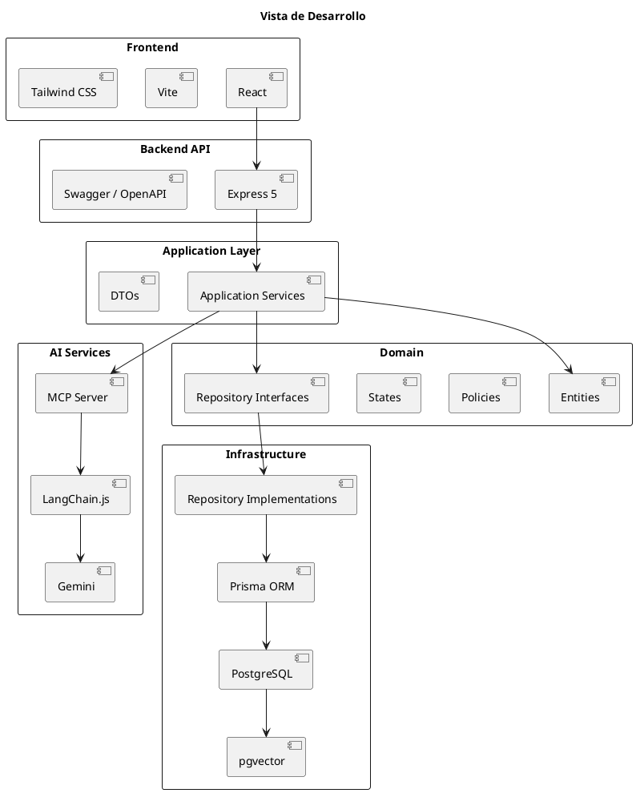
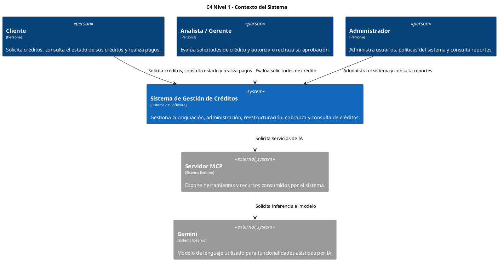
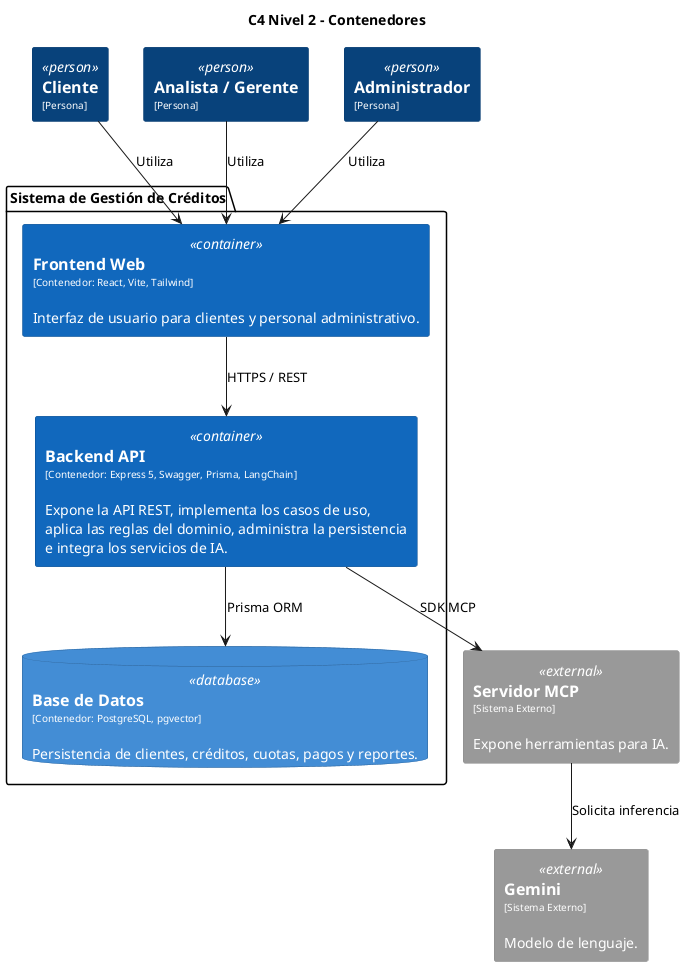
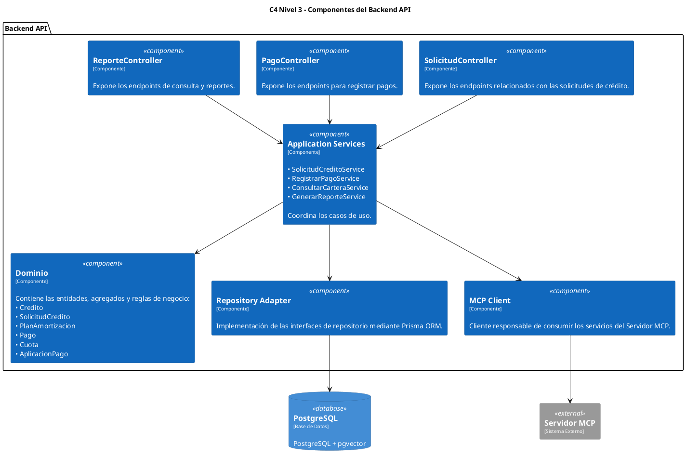

# Entregable 2
# Selección y Justificación de la Arquitectura

## Proyecto 1
### Sistema de Gestión de Créditos

---

# Introducción

El presente documento describe el proceso de selección y justificación de la arquitectura propuesta para el Sistema de Gestión de Créditos desarrollado durante el Proyecto 1.

La selección arquitectónica se realizó considerando los atributos de calidad definidos por la norma ISO/IEC 25010 y mediante la comparación objetiva de diferentes estilos arquitectónicos. Posteriormente se presenta la arquitectura elegida utilizando el modelo de vistas 4+1 de Philippe Kruchten, permitiendo representar el sistema desde diferentes perspectivas y proporcionando una base sólida para su futura implementación.

---

# 1. Priorización de atributos de calidad (ISO/IEC 25010)

Antes de seleccionar un estilo arquitectónico se analizaron las características del dominio del problema con el objetivo de identificar cuáles atributos de calidad representan un mayor impacto para el sistema.

Como resultado del análisis se priorizaron los siguientes atributos:

| Prioridad | Atributo | Justificación |
|-----------|----------|---------------|
| **1** | **Fiabilidad** | El sistema administra créditos, pagos, estados y cálculos financieros. Cualquier error podría producir pérdidas económicas, inconsistencias en la información o decisiones incorrectas sobre los créditos. Por ello, la prioridad principal consiste en garantizar resultados correctos y consistentes durante todo el ciclo de vida del crédito. |
| **2** | **Mantenibilidad** | El dominio del problema puede evolucionar con el tiempo. Durante el análisis se identificó, por ejemplo, que el proceso de aprobación actualmente es realizado por un analista, pero en futuras versiones podrá sustituirse por un algoritmo. La arquitectura debe permitir incorporar estos cambios sin afectar el resto del sistema. |
| **3** | **Seguridad** | El sistema procesa información financiera y datos personales de los clientes. Por ello debe proteger la confidencialidad, integridad y disponibilidad de la información mediante mecanismos adecuados de autenticación, autorización y control de acceso. |

La priorización anterior constituye el criterio utilizado para evaluar los distintos estilos arquitectónicos considerados para el proyecto.

---

# 2. Selección del estilo arquitectónico

## 2.1 Matriz de evaluación

Con base en los atributos priorizados se compararon diferentes estilos arquitectónicos, evaluando el grado en que cada uno favorece el cumplimiento de dichos atributos.

| Estilo Arquitectónico | Fiabilidad | Mantenibilidad | Seguridad | Resultado |
|------------------------|:---------:|:--------------:|:---------:|:---------:|
| Arquitectura en Capas | Favorece | Neutral | Favorece | **2 Favorece** |
| MVC | Favorece | Favorece | Neutral | **2 Favorece** |
| Cliente / Servidor | Neutral | Neutral | Favorece | **1 Favorece** |
| Repositorio | Neutral | Favorece | Neutral | **1 Favorece** |
| **Arquitectura Hexagonal** | **Favorece** | **Favorece** | **Favorece** | **3 Favorece** |

## 2.2 Justificación de la arquitectura seleccionada

Después de comparar las distintas alternativas se determinó que la Arquitectura Hexagonal representa la opción más adecuada para el proyecto.

En primer lugar, favorece la **fiabilidad**, ya que mantiene aisladas las reglas de negocio de los detalles tecnológicos, permitiendo que operaciones críticas como la aplicación de pagos, la generación de planes de amortización y los cambios de estado del crédito permanezcan consistentes independientemente del framework o la tecnología utilizada.

En segundo lugar, favorece la **mantenibilidad**, permitiendo modificar o ampliar las reglas de negocio sin afectar el resto de la aplicación. Esta característica resulta especialmente importante considerando que el proceso de aprobación podrá evolucionar desde una evaluación manual realizada por un analista hasta un algoritmo automatizado.

Finalmente, favorece la **seguridad**, ya que el acceso al dominio se realiza mediante puertos y adaptadores, facilitando la validación de entradas, la autenticación de usuarios y la integración de mecanismos de auditoría.

Como resultado del análisis se seleccionó la Arquitectura Hexagonal como base para el diseño e implementación del Sistema de Gestión de Créditos.

---

# 3. Modelo 4+1

## 3.1 Vista Lógica

La Vista Lógica representa la estructura conceptual del sistema y describe las entidades que conforman el dominio del negocio, así como las relaciones existentes entre ellas.

Durante el Entregable 1 se desarrolló el Modelo del Dominio, el cual constituye la representación lógica del sistema e identifica las principales entidades involucradas en la administración del ciclo de vida de un crédito:

- Cliente
- SolicitudCredito
- Credito
- PlanAmortizacion
- Cuota
- Pago
- AplicacionPago
- RegistroEvento
- Usuario

Estas entidades encapsulan las reglas de negocio y mantienen el dominio completamente independiente de aspectos tecnológicos.

---

## 3.2 Vista de Escenarios

La Vista de Escenarios representa los procesos de negocio más importantes desde la perspectiva de los usuarios y del sistema.

Durante el Entregable 1 se modelaron los principales escenarios mediante Diagramas de Casos de Uso y Diagramas de Secuencia, destacando principalmente:

- Originación del crédito.
- Registro de pago de cuotas.

El escenario de originación describe el proceso completo desde que el cliente solicita un crédito hasta la generación del plan de amortización y sus respectivas cuotas.

Por su parte, el escenario de registro de pagos muestra la aplicación de la prelación, la actualización del estado del crédito y el registro del evento correspondiente.

Estos escenarios permitieron validar la distribución de responsabilidades dentro del dominio y comprobar la consistencia del diseño.

---

## 3.3 Vista de Desarrollo

La Vista de Desarrollo muestra la organización del software durante su implementación.

Para este proyecto se propone la siguiente estructura arquitectónica:

- **Frontend**
  - React
  - Vite
  - Tailwind CSS

- **Backend API**
  - Express 5
  - Swagger / OpenAPI

- **Application Layer**
  - Casos de uso
  - Servicios
  - DTOs

- **Domain**
  - Entidades
  - Policies
  - States
  - Interfaces de Repositorio

- **Infrastructure**
  - Prisma ORM
  - PostgreSQL
  - pgvector
  - Implementaciones de Repositorio

- **AI Services**
  - MCP Server
  - LangChain.js
  - Gemini

El objetivo de esta distribución consiste en mantener completamente aisladas las reglas de negocio de las tecnologías utilizadas para la persistencia, la interfaz de usuario y la integración con servicios externos.

### Diagrama de Vista de Desarrollo

---

# 4. Modelo C4

El modelo C4 permite representar progresivamente la arquitectura del sistema, iniciando desde una vista general del contexto hasta llegar a los principales componentes internos del backend.

Para este proyecto se desarrollan los tres primeros niveles del modelo C4.

---

## 4.1 Nivel 1 - Contexto

El diagrama de contexto representa el Sistema de Gestión de Créditos como una única unidad funcional, mostrando los actores que interactúan con él y los sistemas externos necesarios para cumplir sus responsabilidades.

En este nivel no se muestran tecnologías, bases de datos ni componentes internos; únicamente se representan las relaciones entre el sistema y su entorno.

### Justificación

En el Nivel 1 únicamente se representan los actores y sistemas externos que interactúan con el Sistema de Gestión de Créditos.

No se incluyen componentes internos, bases de datos, frameworks o librerías, ya que dichos elementos pertenecen a los niveles inferiores del modelo C4.

El Servidor MCP se representa como un sistema externo independiente porque constituye el punto de integración entre el sistema y los servicios de inteligencia artificial. Por su parte, Gemini se modela como un sistema externo proveedor del modelo de lenguaje, mientras que tecnologías de implementación como React, Express, Prisma o LangChain se reservan para los niveles posteriores del modelo.

## 4.2 Nivel 2 - Contenedores

El diagrama de contenedores muestra la descomposición del Sistema de Gestión de Créditos en sus principales aplicaciones y almacenes de datos, así como las relaciones existentes entre ellos.

A diferencia del Nivel 1, en esta vista ya se representan los contenedores tecnológicos que conforman la solución, manteniendo ocultos los detalles internos de implementación.

### Justificación

El Nivel 2 identifica los principales contenedores que conforman la solución tecnológica propuesta.

El **Frontend Web** concentra toda la interacción con los usuarios mediante una aplicación desarrollada con React, Vite y Tailwind CSS.

El **Backend API** constituye el núcleo de la aplicación, implementando los casos de uso definidos durante el análisis, aplicando las reglas del dominio y coordinando el acceso a la persistencia y a los servicios externos.

La **Base de Datos** almacena de forma persistente la información relacionada con clientes, créditos, cuotas, pagos, reportes y demás entidades del dominio utilizando PostgreSQL y la extensión pgvector.

Finalmente, el **Servidor MCP** se integra como un sistema externo especializado que permite acceder a capacidades de inteligencia artificial proporcionadas por **Gemini**, manteniendo desacoplada la lógica del negocio respecto al modelo de lenguaje utilizado.

## 4.3 Nivel 3 - Componentes

El Nivel 3 descompone el contenedor **Backend API**, mostrando los principales componentes internos y la forma en que colaboran para implementar los casos de uso definidos durante el análisis.
Cada componente encapsula una responsabilidad específica, manteniendo la separación entre presentación, aplicación, dominio, persistencia e integración con servicios externos, de acuerdo con la Arquitectura Hexagonal seleccionada.

---

### Justificación

El Nivel 3 muestra la organización interna del *Backend API*, identificando los componentes responsables de implementar los casos de uso definidos durante el análisis.

Los *Controllers* constituyen el punto de entrada de la API REST y delegan la ejecución de cada operación a los *Application Services*, los cuales coordinan el flujo de los casos de uso sin contener reglas de negocio.

Las reglas del negocio permanecen encapsuladas dentro del componente *Dominio*, donde residen las entidades, agregados y políticas diseñadas durante el Entregable 1.

El acceso a la persistencia se realiza mediante un *Repository Adapter* implementado con Prisma ORM, preservando el desacoplamiento entre el dominio y la base de datos establecido por la Arquitectura Hexagonal.

Finalmente, la integración con capacidades de inteligencia artificial se realiza mediante un **MCP Client**, encargado de comunicarse con el Servidor MCP sin introducir dependencias directas entre el dominio y los servicios externos.

---

# Conclusiones

La selección de la Arquitectura Hexagonal respondió a un proceso de análisis basado en atributos de calidad y no únicamente en preferencias tecnológicas.

La priorización de la fiabilidad, mantenibilidad y seguridad permitió comparar objetivamente diferentes estilos arquitectónicos, concluyendo que la Arquitectura Hexagonal constituye la alternativa más adecuada para el Sistema de Gestión de Créditos.

El modelo 4+1 permitió representar la solución desde diferentes perspectivas, mientras que el modelo C4 facilitó describir progresivamente la arquitectura, desde el contexto general hasta los componentes internos del backend.

La arquitectura propuesta proporciona una base sólida para la implementación utilizando React, Express, Prisma ORM, PostgreSQL con pgvector, LangChain.js, el servidor MCP y Gemini, manteniendo un bajo acoplamiento entre las reglas del negocio y las tecnologías utilizadas.