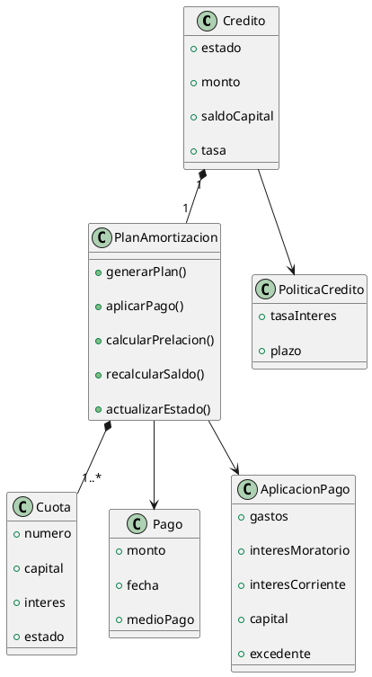
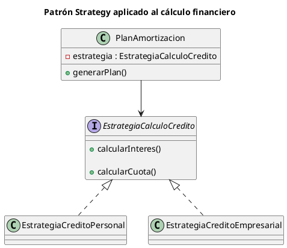
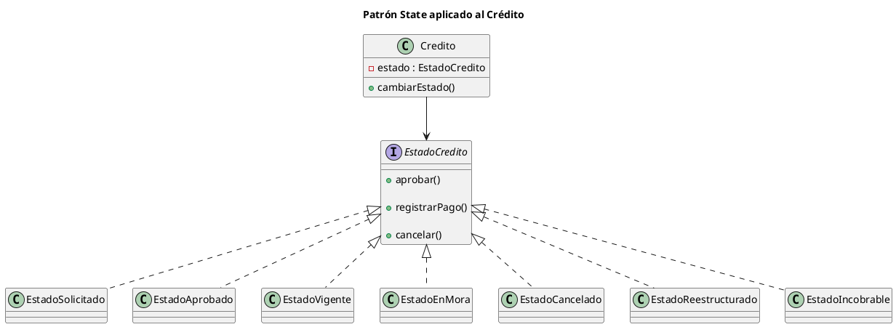
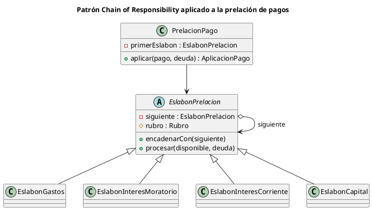

# Entregable 3
# Diseño de Componentes y Principios

## Proyecto 1

### Sistema de Gestión de Créditos

---

# Introducción

El presente documento describe el diseño interno de los principales componentes del Sistema de Gestión de Créditos, tomando como base la Arquitectura Hexagonal seleccionada durante el Entregable 2.

Se presenta la descomposición del sistema en módulos con responsabilidad única, el diseño detallado del módulo de cálculo financiero, la aplicación de los principios SOLID y GRASP, los patrones de diseño empleados y un análisis de cohesión y acoplamiento entre los diferentes módulos.

---

# 1. Descomposición en módulos

La Arquitectura Hexagonal permite dividir el sistema en módulos con responsabilidades claramente definidas, reduciendo el acoplamiento y facilitando la evolución del software.

## 1.1 Módulo de Presentación

| Aspecto | Descripción |
|----------|-------------|
| **Responsabilidad** | Gestionar la interacción con los usuarios y recibir las solicitudes realizadas desde la interfaz web. |
| **Componentes** | Frontend Web (React, Vite y Tailwind CSS), SolicitudController, PagoController y ReporteController. |
| **Interfaces que ofrece** | Endpoints REST para originación de créditos, registro de pagos, consulta de créditos y generación de reportes. |
| **Interfaces que consume** | Application Services. |

---

## 1.2 Módulo de Aplicación

| Aspecto | Descripción |
|----------|-------------|
| **Responsabilidad** | Coordinar los casos de uso del sistema sin contener reglas propias del negocio. |
| **Componentes** | SolicitudCreditoService, RegistrarPagoService, ConsultarCarteraService y GenerarReporteService. |
| **Interfaces que ofrece** | RegistrarSolicitud(), RegistrarPago(), ConsultarCartera() y GenerarReporte(). |
| **Interfaces que consume** | Dominio, Repository Adapter y MCP Client. |

---

## 1.3 Módulo de Dominio

| Aspecto | Descripción |
|----------|-------------|
| **Responsabilidad** | Implementar las reglas del negocio y mantener la consistencia del modelo de dominio. |
| **Componentes** | Credito, SolicitudCredito, PlanAmortizacion, Cuota, Pago, AplicacionPago y RegistroEvento. |
| **Interfaces que ofrece** | Operaciones propias del dominio como generarPlan(), registrarPago(), recalcularSaldo() y actualizarEstado(). |
| **Interfaces que consume** | Ninguna. El dominio permanece independiente de detalles tecnológicos. |

---

## 1.4 Módulo de Persistencia

| Aspecto | Descripción |
|----------|-------------|
| **Responsabilidad** | Almacenar y recuperar la información persistente del sistema. |
| **Componentes** | Repository Adapter implementado mediante Prisma ORM. |
| **Interfaces que ofrece** | CreditoRepository, SolicitudRepository y demás interfaces de acceso a datos. |
| **Interfaces que consume** | PostgreSQL y pgvector. |

---

## 1.5 Módulo de Inteligencia Artificial

| Aspecto | Descripción |
|----------|-------------|
| **Responsabilidad** | Gestionar la comunicación con los servicios externos de inteligencia artificial. |
| **Componentes** | MCP Client. |
| **Interfaces que ofrece** | Servicios de consulta al Servidor MCP. |
| **Interfaces que consume** | Servidor MCP y Gemini. |

---

# 2. Diseño del módulo de Cálculo Financiero

El módulo de cálculo financiero constituye el núcleo del Sistema de Gestión de Créditos, ya que concentra las operaciones relacionadas con la generación del plan de amortización, la aplicación de pagos, la actualización del saldo del crédito y el cálculo de las cuotas.

Durante el análisis se identificó a la clase **PlanAmortizacion** como el principal experto de información (Information Expert), debido a que posee el conocimiento necesario para coordinar todas las operaciones financieras sin distribuir las reglas del negocio entre múltiples clases.

---

# 3. Aplicación de GRASP

Durante el diseño del Sistema de Gestión de Créditos se aplicaron explícitamente diversos principios GRASP para distribuir las responsabilidades entre los componentes del dominio y mantener un diseño de bajo acoplamiento y alta cohesión.

| Principio | Dónde se aplica | Justificación |
|------------|-----------------|---------------|
| **Information Expert** | PlanAmortizacion | Se identificó como el experto de información para generar el plan de amortización, aplicar la prelación de pagos, recalcular saldos y actualizar el estado del crédito, ya que concentra toda la información necesaria para realizar dichas operaciones. |
| **Creator** | PlanAmortizacion → Pago y AplicacionPago | Durante el registro de un pago, PlanAmortizacion crea las instancias de Pago y AplicacionPago porque posee toda la información necesaria para inicializarlas correctamente y mantener la consistencia del proceso financiero. |
| **Low Coupling** | Arquitectura Hexagonal | El dominio no depende de frameworks, bases de datos ni tecnologías externas. La persistencia se realiza mediante interfaces de repositorio y adaptadores, reduciendo las dependencias entre módulos. |
| **High Cohesion** | Application Services | Cada servicio implementa un único caso de uso (RegistrarPago, RegistrarSolicitud, ConsultarCartera o GenerarReporte), evitando mezclar responsabilidades dentro del mismo componente. |
| **Controller** | SolicitudController, PagoController y ReporteController | Los controladores reciben las solicitudes HTTP, validan la entrada y delegan la ejecución de cada caso de uso a los servicios de aplicación, evitando incorporar reglas del negocio en la capa de presentación. |

---

# 4. Aplicación de SOLID

El diseño de los componentes también incorpora los principios SOLID con el objetivo de facilitar el mantenimiento y evolución del sistema.

| Principio | Dónde se aplica | Justificación |
|------------|-----------------|---------------|
| **SRP (Single Responsibility Principle)** | Controllers, Application Services, Repository Adapter y MCP Client | Cada componente posee una única responsabilidad claramente definida. Los controladores gestionan solicitudes, los servicios coordinan casos de uso, los repositorios administran la persistencia y el MCP Client concentra la integración con servicios de inteligencia artificial. |
| **OCP (Open/Closed Principle)** | PlanAmortizacion mediante Strategy |El módulo de cálculo financiero delega el algoritmo de cálculo a una estrategia concreta. Esto permite incorporar nuevos tipos de crédito o nuevas políticas de cálculo implementando nuevas estrategias sin modificar la clase PlanAmortizacion, manteniendo el sistema abierto a extensión y cerrado a modificación. |
| **LSP (Liskov Substitution Principle)** | Implementaciones de Repository | Cualquier implementación concreta de las interfaces de repositorio puede sustituirse sin afectar el funcionamiento del dominio ni de los servicios de aplicación. |
| **ISP (Interface Segregation Principle)** | Repository Interfaces | Cada interfaz define únicamente las operaciones necesarias para el componente que la utiliza, evitando dependencias innecesarias. |
| **DIP (Dependency Inversion Principle)** | Arquitectura Hexagonal | Los servicios de aplicación y el dominio dependen de abstracciones (interfaces de repositorio) y no de implementaciones concretas como Prisma ORM o PostgreSQL. |

---

# 5. Patrones de Diseño

Durante el diseño del sistema se utilizaron patrones arquitectónicos y de diseño que favorecen la mantenibilidad, extensibilidad y claridad del dominio.

| Patrón | Tipo | Aplicación |
|---------|------|------------|
| **State** | GoF | Modela los diferentes estados del crédito (Solicitado, Aprobado, Vigente, En Mora, Reestructurado, Cancelado e Incobrable), encapsulando el comportamiento asociado a cada estado. |
| **Strategy** | GoF | Permite implementar diferentes políticas de cálculo para distintos tipos de crédito sin modificar el resto del sistema. |
| **Chain of Responsibility** | GoF | Encadena los rubros de la prelación de pagos (gastos, interés moratorio, interés corriente y capital). Cada eslabón consume lo que le corresponde y pasa el remanente al siguiente. |
| **Repository** | Arquitectónico | Abstrae el acceso a la persistencia mediante interfaces implementadas posteriormente con Prisma ORM. |
| **Service Layer** | Arquitectónico | Centraliza la coordinación de los casos de uso mediante los Application Services, manteniendo separadas las reglas del negocio de la infraestructura. |

---

## 5.1 Patrón Strategy

El patrón **Strategy** se aplica para encapsular las diferentes políticas de cálculo financiero que pueden existir para distintos tipos de crédito.

De esta manera, el sistema puede incorporar nuevas estrategias de cálculo sin modificar el resto de la lógica del negocio, cumpliendo con el principio **Open/Closed (OCP)**.

### Justificación

El módulo de cálculo financiero delega el algoritmo de cálculo a una estrategia concreta, permitiendo incorporar nuevos tipos de crédito sin modificar la clase `PlanAmortizacion`.

## 5.2 Patrón State

El patrón **State** se utiliza para modelar el ciclo de vida de un crédito.

Cada estado encapsula el comportamiento permitido para dicho momento del proceso, evitando condicionales extensos y facilitando la incorporación de nuevos estados.

### Justificación

La clase `Credito` delega su comportamiento al objeto que representa su estado actual. De esta forma, las transiciones de estado permanecen encapsuladas y pueden evolucionar sin modificar la lógica principal del dominio.

---

## 5.3 Patrón Chain of Responsibility

El patrón **Chain of Responsibility** se aplica al orden de aplicación de un pago (prelación).

Cada rubro adeudado se modela como un eslabón que consume lo que le corresponde y entrega el remanente al siguiente. Ningún eslabón conoce la cadena completa: únicamente a su sucesor.

### Justificación

El orden de aplicación de un pago es una regla de negocio, no un detalle de implementación: modificarlo altera cuánto debe el cliente y cuánto reconoce la institución como ingreso.

Al modelar cada rubro como un eslabón, ese orden deja de estar escrito dentro del cuerpo de un método y pasa a ser la manera en que se arma la cadena. Incorporar un rubro nuevo o alterar la prelación no obliga a modificar `PrelacionPago`, lo que cumple el principio **Open/Closed (OCP)**.

---

# 6. Análisis de Cohesión y Acoplamiento

El diseño propuesto presenta una alta cohesión, ya que cada módulo concentra responsabilidades relacionadas entre sí y evita mezclar lógica de presentación, aplicación, dominio y persistencia.

Asimismo, el sistema mantiene un bajo acoplamiento gracias a la Arquitectura Hexagonal, donde las dependencias se establecen mediante interfaces y adaptadores. Esto permite sustituir tecnologías como Prisma ORM, PostgreSQL o incluso el modelo de lenguaje utilizado por el sistema sin modificar las reglas del negocio.

La separación entre Application Services, Dominio, Repository Adapter y MCP Client favorece la evolución del sistema, permitiendo incorporar nuevas funcionalidades o tecnologías con un impacto mínimo sobre los componentes existentes.

