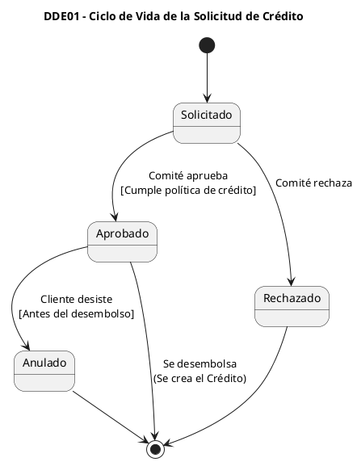

# DDE-01 Ciclo de Vida de la Solicitud de Crédito

## Código PlantUML



## Resultado


# DDE-02 Ciclo de Vida del Crédito

## Código PlantUML

```plantuml
@startuml
title DDE-02 - Ciclo de Vida del Crédito

skinparam shadowing false

[*] --> Desembolsado

Desembolsado --> Vigente : Capital entregado\nal cliente

Vigente --> EnMora : Vence una cuota\n[diasAtraso >= 1]

Vigente --> Cancelado : Paga la última cuota\n[saldo == 0]

EnMora --> Vigente : Paga TODO lo vencido\n[diasAtraso == 0]

EnMora --> EnMora : Pago PARTE de lo vencido\n[diasAtraso disminuye]

EnMora --> Reestructurado : Comité autoriza\nnuevas condiciones

EnMora --> Incobrable : diasAtraso > 120

EnMora --> Cancelado : Paga TODO lo adeudado
[saldo == 0 y sin cuotas vencidas]

Reestructurado --> Vigente : Cumple nuevo plan\n[Según política de cura]

Reestructurado --> EnMora : Se atrasa nuevamente\n[diasAtraso >= 1]

Reestructurado --> Cancelado : Paga última cuota\n[saldo == 0]

Cancelado --> [*]

Incobrable --> [*]

@enduml
```

## Correccion CP-04.1 (Proyecto 2)

La transicion **en_mora → cancelado** no estaba en la tabla 6.7.1 del
Proyecto 1, pero el escenario C de pago de mas (6.6.5) afirma que si el
excedente cancela todo el saldo el credito pasa a CANCELADO. Un credito en
mora que liquidaba su deuda no tenia, segun la tabla, a donde ir.

Se agrega con su evento —un pago que liquida lo adeudado— y su guarda, que
son dos condiciones juntas: **saldo de capital en 0.00 exacto Y sin cuotas
vencidas pendientes**. La segunda importa porque el capital puede llegar a
cero quedando aun intereses o gastos vencidos sin pagar, y un credito asi
no esta cancelado.

Implementada en `src/dominio/estados/estados-credito.ts` y verificada en
`tests/correcciones-p1.test.ts`.

## Resultado

