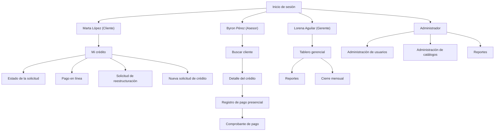

# E2 · Arquitectura de Información
# Mapa de Navegación

## Introducción

El siguiente mapa de navegación representa la organización de las pantallas del sistema desde la perspectiva de las personas identificadas durante el Entregable 1.

Cada perfil accede únicamente a las funcionalidades necesarias para desempeñar sus tareas, reduciendo la complejidad de la navegación y facilitando el cumplimiento de sus objetivos.

Las rutas de navegación fueron diseñadas tomando como referencia los casos de uso definidos durante el Proyecto 1 y refinadas a partir del análisis de usuarios realizado en el Proyecto 2.

---

---

## Decisiones de navegación

- Cada perfil inicia en la pantalla que representa su actividad principal dentro del sistema.
- Marta accede directamente a **Mi crédito**, ya que desde esta pantalla puede consultar el estado de su préstamo, revisar la mora y realizar pagos.
- Byron inicia en **Buscar cliente**, debido a que todas sus actividades comienzan localizando al cliente que visitará.
- Lorena accede directamente al **Tablero gerencial**, donde dispone de los indicadores necesarios para la toma de decisiones.
- El Administrador accede a los módulos de configuración del sistema, manteniendo separadas las funciones operativas de las administrativas.
- Las acciones como **Pago en línea**, **Registro de pago presencial** y **Comprobante de pago** forman parte de un flujo de trabajo y no se presentan como opciones independientes del menú principal.