# E2 · Wireframes de baja fidelidad

## Objetivo

Los siguientes wireframes representan las pantallas clave identificadas durante la etapa de Arquitectura de Información (E2). Fueron elaborados en baja fidelidad para validar la distribución de la información, la navegación y el flujo de interacción antes del diseño de alta fidelidad y de la implementación.

Cada wireframe responde a una persona identificada durante el Entregable 1 y a uno o más casos de uso definidos en el Proyecto 1. El objetivo es verificar que la interfaz permita completar las tareas principales con la menor carga cognitiva posible y reduciendo el riesgo de errores durante la interacción.

> **Nota:** Algunas imágenes contienen más de una pantalla perteneciente al mismo flujo de navegación. Se presentan juntas para facilitar la comprensión del recorrido del usuario.

---

# WF-01 · Mi crédito

**Persona:** Marta López

**Caso de uso:** Consultar estado del crédito

**Objetivo de la pantalla**

Permitir que Marta comprenda rápidamente el estado actual de su crédito, cuánto debe pagar y si existen cargos adicionales antes de iniciar el proceso de pago.

**Justificación**

La pantalla prioriza la información crítica (monto pendiente, próxima cuota y mora) para evitar que el usuario realice pagos creyendo que ya se encuentra al día, uno de los principales puntos de dolor identificados durante el Journey Map.

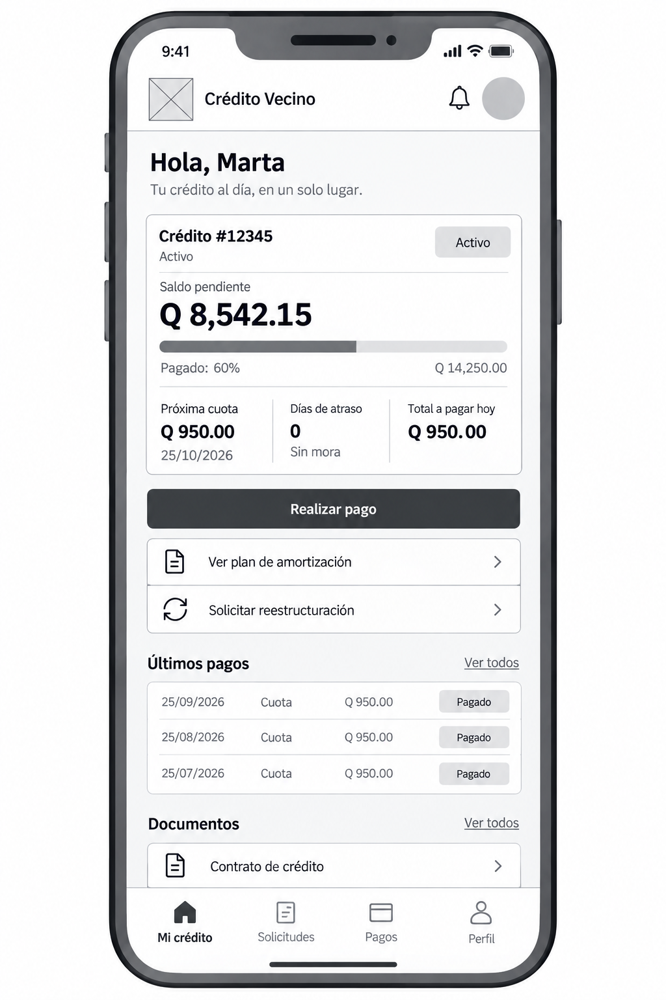

---

# WF-02 · Pago de cuota

**Persona:** Marta López

**Caso de uso:** Realizar pago

**Objetivo de la pantalla**

Permitir el pago del crédito mostrando el monto recomendado y los conceptos que lo conforman.

**Justificación**

Se busca disminuir errores durante el pago priorizando el monto total recomendado antes que el ingreso manual de cantidades.

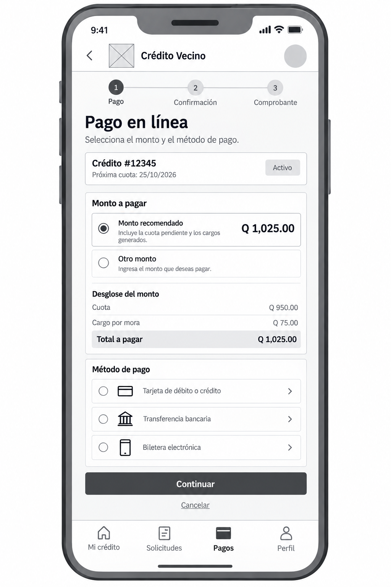

---

# WF-03 · Solicitud de reestructuración

**Persona:** Marta López

**Caso de uso:** Solicitar reestructuración

**Objetivo de la pantalla**

Permitir al cliente iniciar una solicitud de reestructuración cuando considere que no podrá continuar con las condiciones actuales del crédito.

**Justificación**

La pantalla simplifica el proceso mediante un formulario breve, evitando que el usuario deba acudir presencialmente para iniciar la gestión.

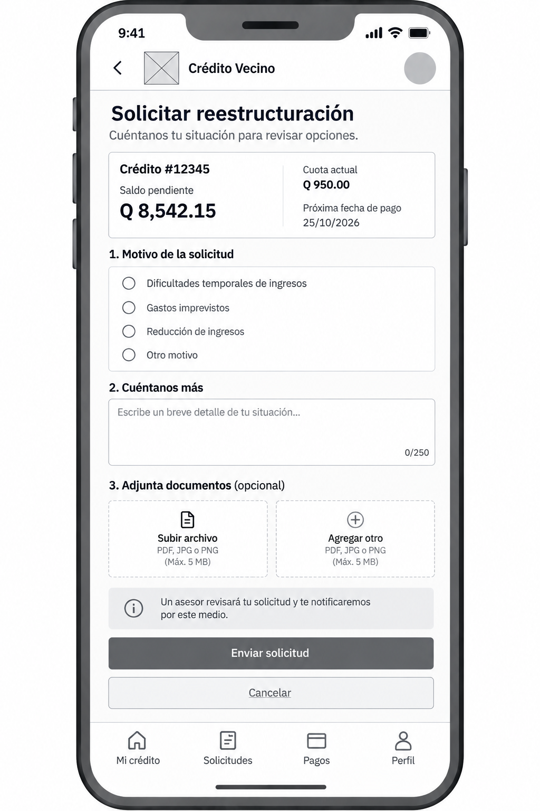

---

# WF-04 · Nueva solicitud de crédito

**Persona:** Marta López

**Caso de uso:** Solicitar crédito

**Objetivo de la pantalla**

Guiar al usuario durante el registro de una nueva solicitud de crédito.

**Justificación**

El proceso se divide en pasos para reducir la carga cognitiva y facilitar el seguimiento del avance durante el llenado de la información.

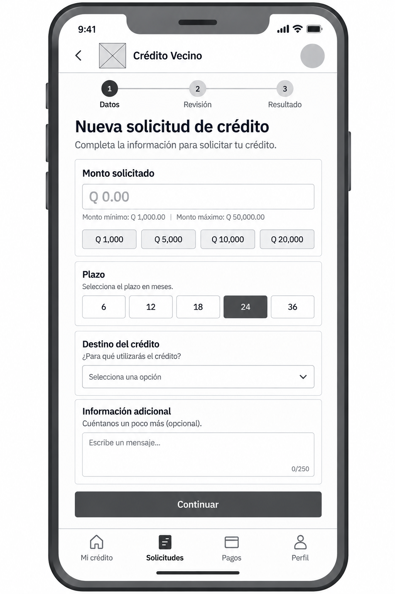

---

# WF-05 · Estado de la solicitud

**Persona:** Marta López

**Caso de uso:** Consultar estado de la solicitud

**Objetivo de la pantalla**

Mostrar el avance del proceso de evaluación del crédito.

**Justificación**

El usuario conoce en qué etapa se encuentra su solicitud sin necesidad de contactar a un asesor, disminuyendo incertidumbre durante la espera.

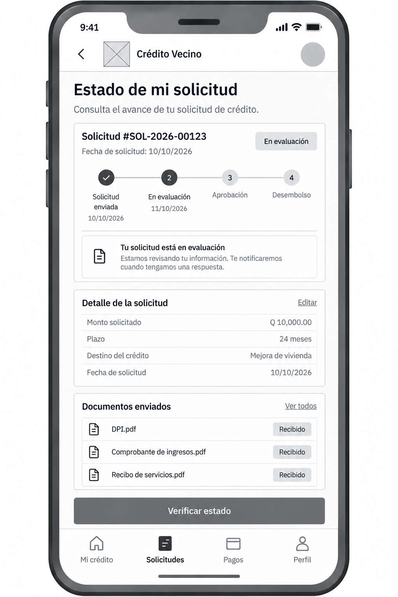

---

# WF-06 · Buscar cliente

**Persona:** Byron Pérez

**Caso de uso:** Registrar pago

**Objetivo de la pantalla**

Localizar rápidamente al cliente durante una visita de cobro.

**Justificación**

El acceso inmediato al expediente reduce el tiempo de atención en campo y permite iniciar el registro del pago sin búsquedas innecesarias.

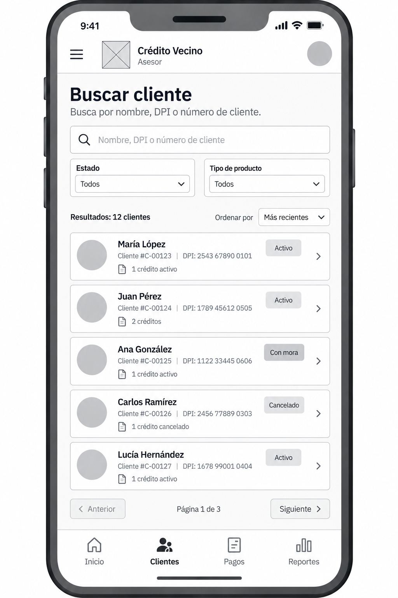

---

# WF-07 · Detalle del crédito

**Persona:** Byron Pérez

**Caso de uso:** Registrar pago

**Objetivo de la pantalla**

Presentar la información necesaria para verificar el estado del crédito antes de registrar un pago.

**Justificación**

Se priorizan los datos indispensables para la gestión en campo, evitando que el asesor tenga que realizar cálculos manuales.

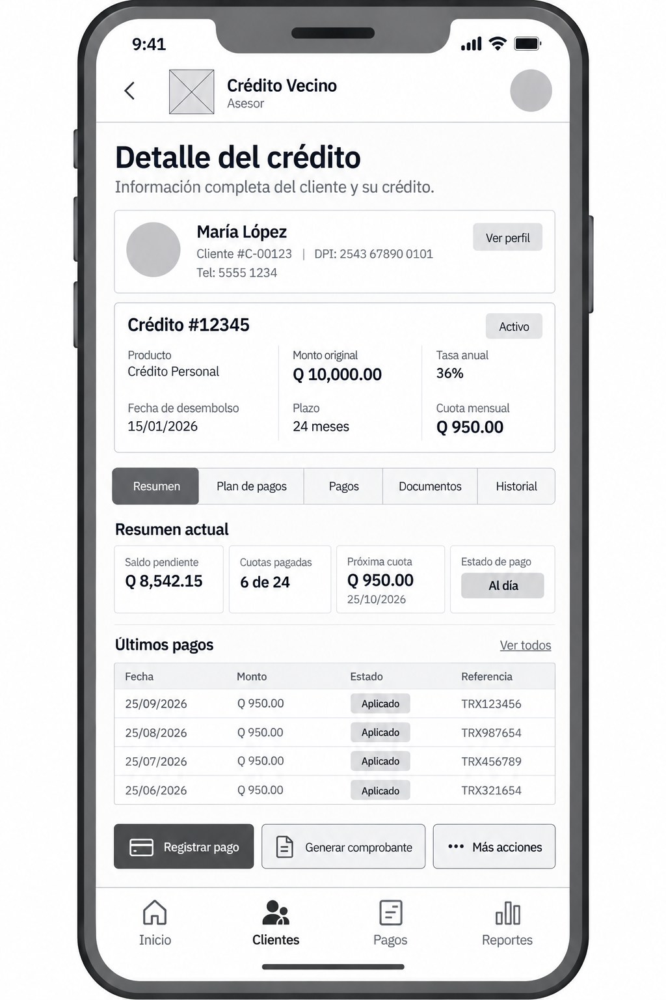

---

# WF-08 · Registro de pago presencial

**Persona:** Byron Pérez

**Caso de uso:** Registrar pago

**Objetivo de la pantalla**

Registrar un pago efectuado durante la visita al cliente.

**Justificación**

El formulario contiene únicamente la información necesaria para completar la operación en pocos pasos, considerando que el asesor trabaja bajo presión de tiempo y con conectividad variable.

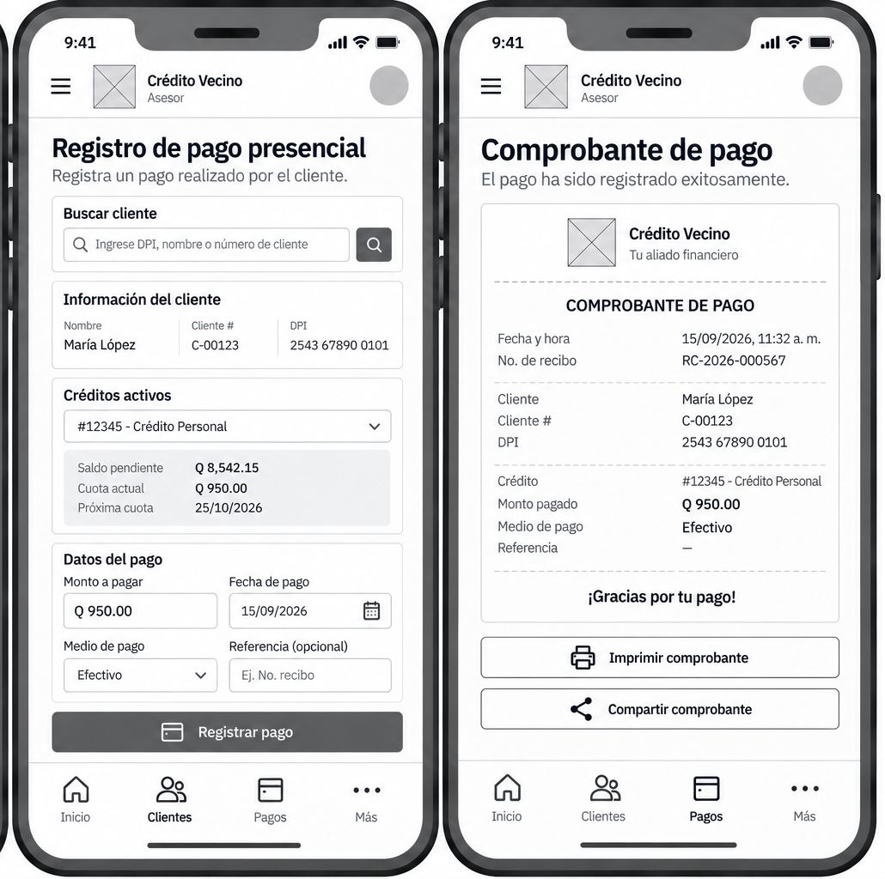

---

# WF-09 · Comprobante de pago

**Persona:** Byron Pérez

**Caso de uso:** Registrar pago

**Objetivo de la pantalla**

Confirmar que el pago fue registrado correctamente y generar un comprobante para el cliente.

**Justificación**

La confirmación inmediata disminuye reclamos posteriores y brinda evidencia de la transacción realizada.

---

# WF-10 · Notificaciones

**Persona:** Byron Pérez

**Caso de uso:** Consultar actividades

**Objetivo de la pantalla**

Mostrar avisos relevantes relacionados con clientes, pagos y solicitudes.

**Justificación**

Las notificaciones permiten al asesor priorizar actividades sin recorrer múltiples pantallas del sistema.

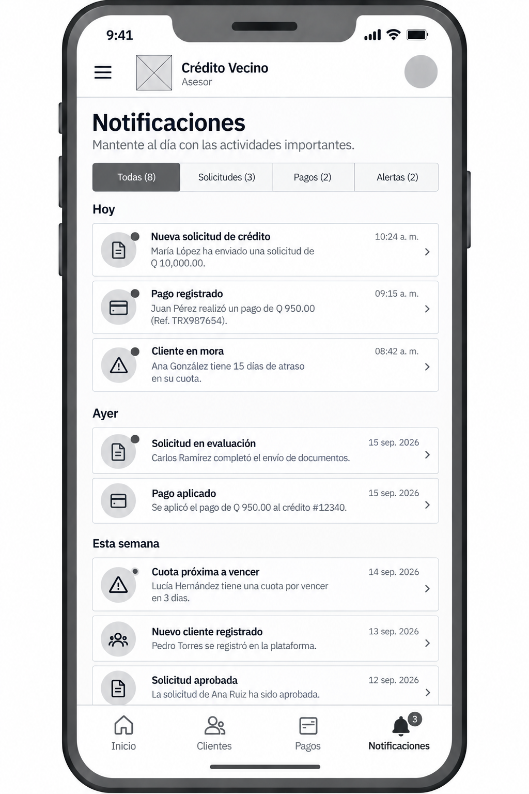

---

# WF-11 · Perfil y configuración

**Persona:** Marta López

**Caso de uso:** Administrar cuenta

**Objetivo de la pantalla**

Permitir la consulta y actualización de la información personal y preferencias básicas del usuario.

**Justificación**

La configuración se mantiene separada de las funciones financieras para evitar errores durante la operación cotidiana.

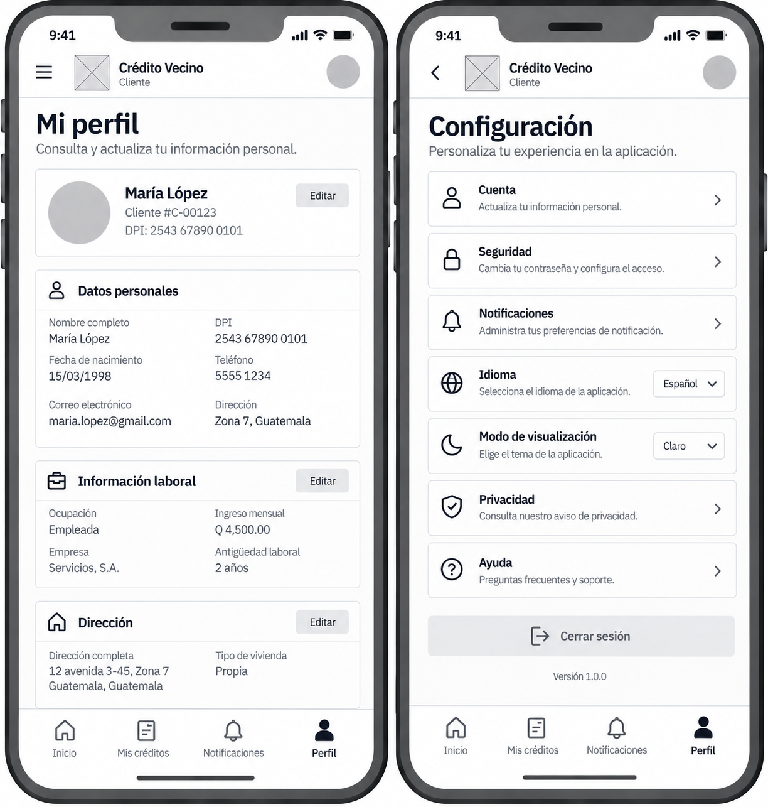

---

# WF-12 · Dashboard gerencial

**Persona:** Lorena Aguilar

**Caso de uso:** Consultar cartera en riesgo

**Objetivo de la pantalla**

Presentar los indicadores estratégicos necesarios para la toma de decisiones.

**Justificación**

La información se organiza por jerarquía visual, mostrando primero los indicadores clave del negocio y posteriormente los gráficos y tablas de apoyo.

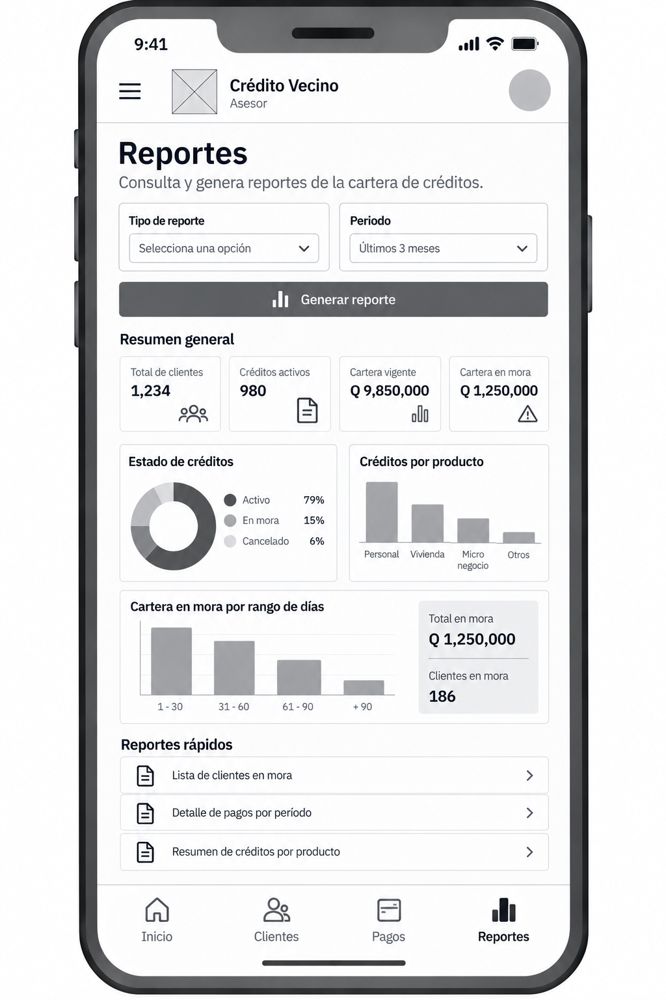

---

# WF-13 · Reportes

**Persona:** Lorena Aguilar

**Caso de uso:** Consultar reportes

**Objetivo de la pantalla**

Permitir la consulta y generación de reportes operativos y gerenciales.

**Justificación**

Los filtros se ubican antes de la información para facilitar la generación de reportes específicos sin recorrer grandes volúmenes de datos.

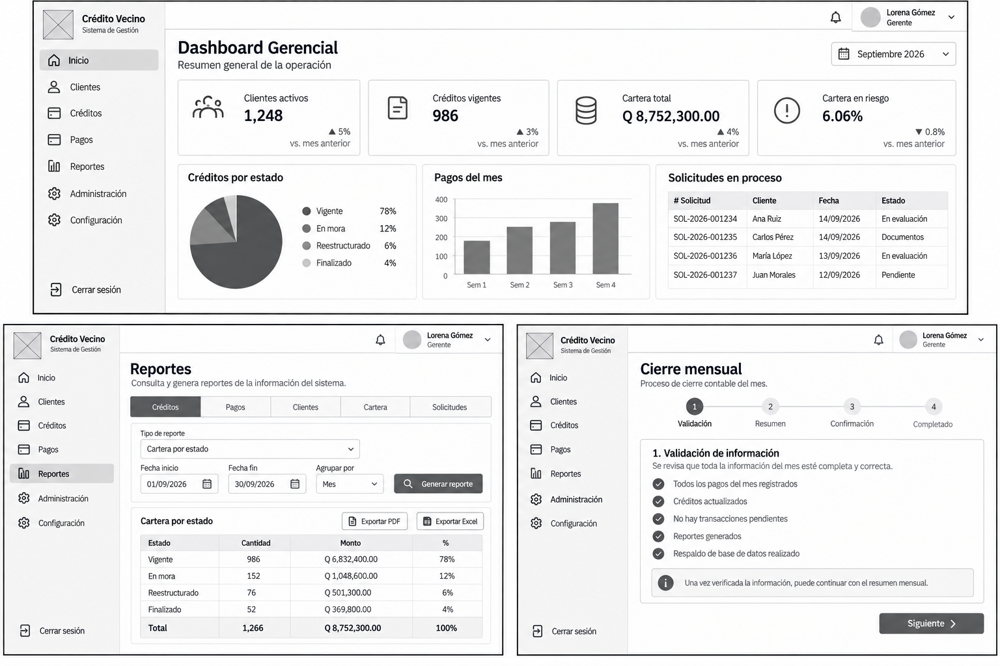

---

# WF-14 · Cierre mensual

**Persona:** Lorena Aguilar

**Caso de uso:** Generar cierre mensual

**Objetivo de la pantalla**

Guiar al usuario durante el proceso de cierre mensual del sistema.

**Justificación**

El flujo se presenta por etapas para reducir omisiones durante una operación crítica para la institución.

---

# WF-15 · Administración

**Persona:** Administrador

**Caso de uso:** Administrar usuarios / Administrar catálogos

**Objetivo de la pantalla**

Gestionar la configuración general del sistema, los usuarios y los catálogos utilizados por la aplicación.

**Justificación**

Las funciones administrativas se mantienen separadas de las operaciones financieras para preservar la seguridad y facilitar la administración del sistema.

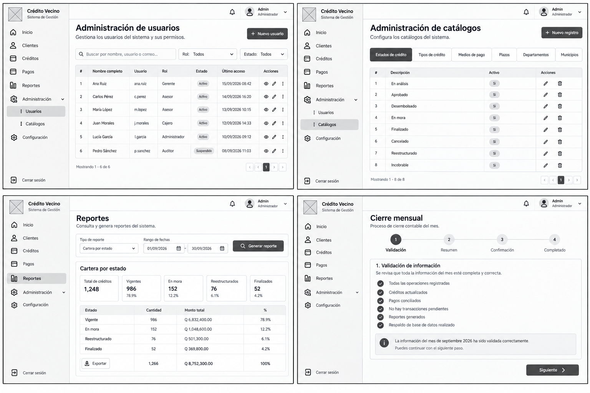