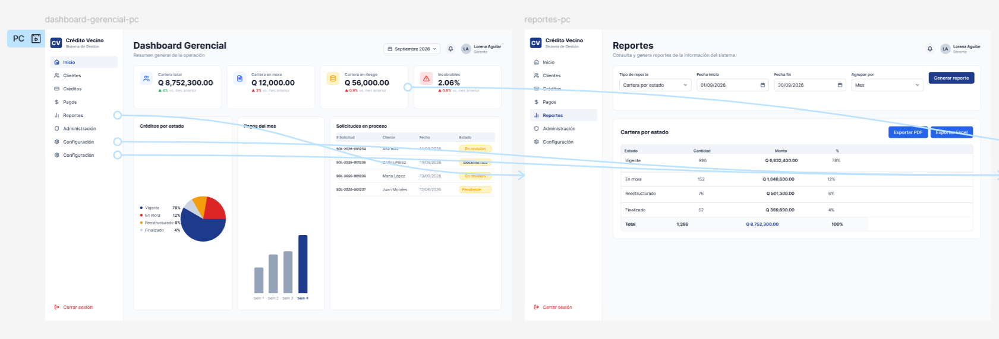
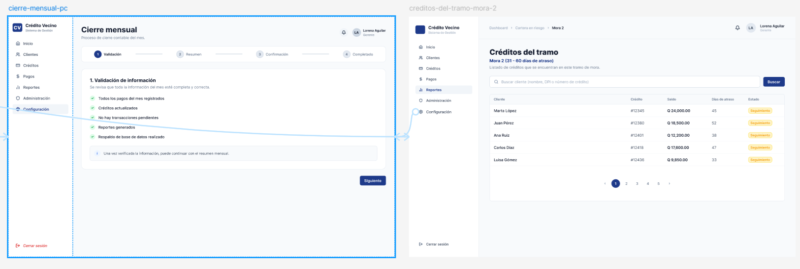

# E3 – Prototipo navegable de alta fidelidad (Figma)

## Integrantes

- Mar Juárez
- Dalila
- Alexander
- Byron

---

# Objetivo

Desarrollar un prototipo navegable de alta fidelidad que represente los principales flujos funcionales del sistema **Crédito Vecino**, utilizando los resultados obtenidos durante el E1 (investigación de usuarios) y el E2 (arquitectura de información y wireframes).

El prototipo busca validar la organización de la información, la navegación entre pantallas y la interacción esperada por cada perfil de usuario antes de iniciar una implementación visual definitiva.

---

# Herramienta utilizada

- **Figma**
- Prototipo de alta fidelidad con navegación interactiva.

Enlace del prototipo:
[Figma - Crédito Vecino](https://www.figma.com/design/oZNRdndoK2Nm2GskdeOjlD/Cr%C3%A9dito-vecino)

---

# Organización del prototipo

El prototipo fue organizado según los tres perfiles identificados durante la investigación de usuarios:

- Asesor
- Cliente
- Gerencia

Cada conjunto de pantallas responde a un flujo de trabajo específico y permite recorrer el sistema sin necesidad de explicaciones adicionales.

---

# Flujo 1 – Originación del crédito

## Objetivo

Permitir que el asesor registre una nueva solicitud, revise la simulación generada por el motor de crédito y confirme el desembolso.

## Pantallas

1. Nueva solicitud de crédito
2. Revisión de la solicitud
3. Crédito aprobado

## Navegación

Solicitud
↓

Revisión del plan

↓

Confirmación del crédito

## Consideraciones de diseño

- El ingreso del monto y plazo se realiza únicamente una vez.
- La simulación se presenta antes de confirmar la solicitud.
- El usuario debe revisar la información antes del desembolso.
- La aprobación presenta un resumen del crédito generado.

---

# Flujo 2 – Cobro en campo

## Objetivo

Permitir que el asesor consulte el estado del crédito, comprenda la composición de la mora y registre un pago siguiendo la prelación definida por el núcleo del sistema.

## Pantallas

1. Detalle del crédito
2. Detalle de la mora
3. Registro de pago
4. Comprobante de pago

## Navegación

Detalle del crédito

↓

Detalle de la mora

↓

Registro del pago

↓

Comprobante

## Consideraciones de diseño

- El cliente se identifica una sola vez durante el proceso.
- El detalle de mora explica la composición del monto adeudado mediante tramos.
- El registro de pago mantiene visible la información principal del crédito.
- El comprobante representa la finalización del proceso de cobro.

---

# Flujo 3 – Consulta gerencial

## Objetivo

Permitir que la gerencia supervise el estado general de la cartera, consulte reportes y ejecute el proceso de cierre mensual.

## Pantallas

1. Dashboard gerencial
2. Reportes
3. Cierre mensual
4. Créditos del tramo

## Navegación

Dashboard

↓

Reportes

↓

Cierre mensual

↓

Créditos pertenecientes al tramo seleccionado

## Consideraciones de diseño

- El Dashboard resume los indicadores principales.
- Los reportes permiten filtrar la información antes de exportarla.
- El cierre mensual presenta un proceso guiado por etapas.
- Desde el Dashboard es posible profundizar hasta visualizar los créditos específicos que forman parte de un tramo de mora.

---

# Cobertura de pantallas obligatorias

| Pantalla requerida | Implementada |
|--------------------|--------------|
| Solicitud de crédito | Sí |
| Detalle del crédito | Sí |
| Registro de pago | Sí |
| Plan de amortización | Sí |
| Detalle de la mora | Sí |
| Tablero gerencial | Sí |
| Cierre diario / mensual | Sí |

---

# Relación con el E2

El prototipo fue construido directamente sobre los wireframes desarrollados durante el E2.

Durante esta etapa se conservaron:

- Arquitectura de información.
- Mapa de navegación.
- Distribución general de las pantallas.
- Agrupación de funcionalidades por perfil.

Posteriormente se incorporaron elementos propios de una interfaz de alta fidelidad, incluyendo tipografía, componentes, iconografía, estados visuales y navegación interactiva entre pantallas.

---

# Decisiones de diseño

Durante el desarrollo del prototipo se tomaron las siguientes decisiones:

- Separar los flujos según el perfil del usuario.
- Mantener consistencia visual entre todas las pantallas.
- Utilizar una navegación simple y lineal para las tareas críticas.
- Priorizar la visibilidad de la información financiera relevante.
- Reducir la cantidad de pasos necesarios para completar cada proceso.
- Mantener visibles las acciones principales en cada pantalla.

---

# Preparación para la evaluación heurística

El prototipo fue preparado considerando la siguiente fase del proyecto (E5), en la cual será sometido a una evaluación heurística basada en las heurísticas de Nielsen y en criterios de accesibilidad WCAG 2.2.

La estructura navegable permite identificar con facilidad problemas relacionados con:

- Navegación.
- Consistencia.
- Prevención de errores.
- Visibilidad del estado del sistema.
- Correspondencia con el mundo real.
- Accesibilidad.

---

# Evidencias

Se adjuntan:

- Capturas del prototipo.
- Flujo de originación.
- Flujo de cobro.
- Flujo gerencial.
- Enlace al archivo de Figma.

---

# Conclusiones

El prototipo desarrollado representa los principales procesos funcionales del sistema Crédito Vecino y constituye una base adecuada para la evaluación heurística y las siguientes etapas del proyecto.

La navegación implementada permite recorrer los tres flujos definidos por el enunciado, manteniendo coherencia con la arquitectura de información establecida en el E2 y con las reglas de negocio implementadas en el núcleo del sistema.

# Nota
Durante la construcción del prototipo se utilizó Figma AI como herramienta de apoyo para generar propuestas iniciales de interfaces a partir de los wireframes desarrollados en el E2.

Las propuestas generadas fueron posteriormente revisadas, reorganizadas y modificadas manualmente para asegurar su consistencia con:

- la arquitectura de información definida en el E2;
- los flujos obligatorios establecidos en el enunciado;
- las reglas de negocio implementadas en el núcleo del sistema;
- los principios de usabilidad y accesibilidad considerados para la evaluación heurística posterior.

El resultado final corresponde a un prototipo revisado y adaptado manualmente.