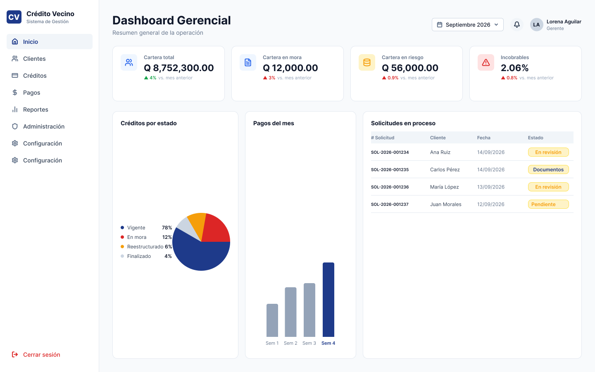
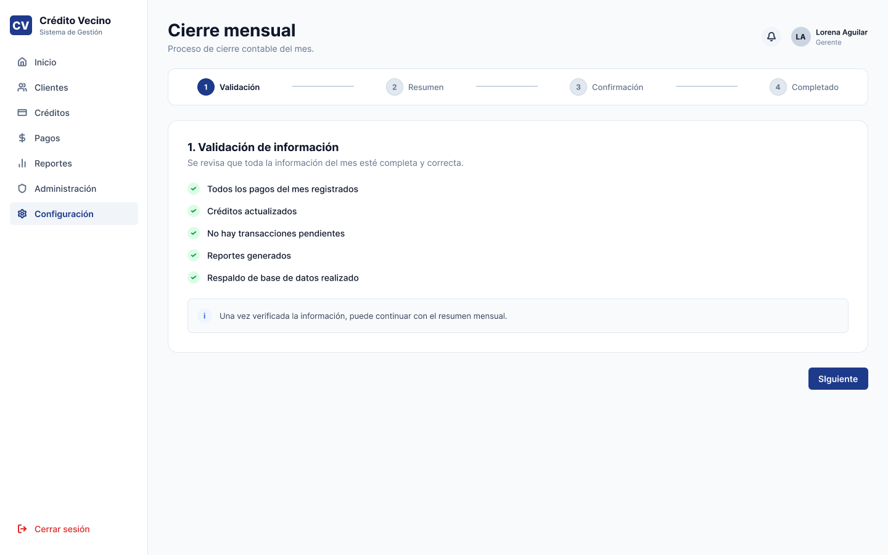

# E5 · Evaluación heurística y de accesibilidad

## Proyecto

Crédito Vecino

## Objetivo

El objetivo de esta evaluación fue identificar problemas de usabilidad y accesibilidad presentes en el prototipo de alta fidelidad desarrollado para **Crédito Vecino**, aplicando las **10 heurísticas de Nielsen**, los criterios de **WCAG 2.2 Nivel AA** y los principios **POUR**.

Cada integrante realizó una evaluación independiente del prototipo. Posteriormente, los hallazgos fueron consolidados, eliminando observaciones repetidas y priorizando aquellas con mayor impacto sobre la experiencia del usuario.

La evaluación permitió detectar oportunidades de mejora relacionadas con la claridad de la información, prevención de errores, consistencia de la interfaz y accesibilidad, las cuales fueron incorporadas al prototipo final.

---

# 1. Evaluación heurística (Nielsen)

## Resumen

Se identificaron ocho hallazgos relevantes durante la evaluación heurística del prototipo.

| Hallazgo | Heurística | Severidad |
|----------|------------|-----------|
| H-01 | Correspondencia entre el sistema y el mundo real | 2 |
| H-02 | Control y libertad del usuario | 2 |
| H-03 | Prevención de errores | 3 |
| H-04 | Reconocimiento antes que recuerdo | 2 |
| H-05 | Flexibilidad y eficiencia de uso | 2 |
| H-06 | Diseño estético y minimalista | 1 |
| H-07 | Ayuda para reconocer errores | 2 |
| H-08 | Consistencia y estándares | 1 |

---

# Hallazgo H-01

## Heurística

**H2 – Correspondencia entre el sistema y el mundo real**

## Pantalla

Dashboard Gerencial

## Problema identificado

El Dashboard utiliza términos financieros especializados como **Cartera en mora**, **Cartera en riesgo** e **Incobrables** sin ofrecer una explicación de su significado.

Aunque estos conceptos son comunes dentro del ámbito financiero, un gerente nuevo o un usuario con poca experiencia puede no comprender inmediatamente las diferencias entre ellos.

## Severidad

**2 – Problema menor de usabilidad**

## Corrección propuesta

Agregar ayuda contextual mediante tooltips o un ícono de información que explique el significado de cada indicador.

---

# Hallazgo H-02

## Heurística

**H3 – Control y libertad del usuario**

## Pantalla

Cierre mensual

## Problema identificado

Durante el flujo de cierre mensual únicamente existe la opción **Siguiente**, sin ofrecer una alternativa para cancelar el proceso o regresar al Dashboard.

Esto limita el control del usuario durante una operación administrativa.

## Severidad

**2**

## Corrección propuesta

Agregar un botón **Cancelar** o **Guardar y salir** para abandonar el flujo sin perder el contexto.

---

# Hallazgo H-03

## Heurística

**H5 – Prevención de errores**

## Pantalla

Registro de pago

## Problema identificado

El prototipo no comunica visualmente las validaciones del formulario.

Por ejemplo, no informa si:

- el monto excede el saldo pendiente,
- la fecha es inválida,
- existen campos obligatorios sin completar.

Aunque estas validaciones pueden implementarse posteriormente en desarrollo, el prototipo debería anticiparlas para mejorar la experiencia del usuario.

## Severidad

**3 – Problema importante**

## Corrección propuesta

Mostrar mensajes preventivos y deshabilitar el botón **Registrar pago** hasta completar correctamente toda la información requerida.

---

# Hallazgo H-04

## Heurística

**H6 – Reconocimiento antes que recuerdo**

## Pantalla

Reportes

## Problema identificado

Cada vez que el usuario genera un reporte debe volver a configurar el tipo de reporte, las fechas y el criterio de agrupación.

No existen filtros recientes ni configuraciones recordadas.

## Severidad

**2**

## Corrección propuesta

Guardar la última configuración utilizada o proporcionar accesos rápidos a los reportes más frecuentes.

---

# Hallazgo H-05

## Heurística

**H7 – Flexibilidad y eficiencia de uso**

## Pantalla

Créditos del tramo

## Problema identificado

La búsqueda únicamente permite localizar créditos mediante texto.

No existen filtros por:

- estado
- monto
- días de atraso
- saldo

Lo anterior disminuye la eficiencia del trabajo del gerente cuando administra grandes cantidades de registros.

## Severidad

**2**

## Corrección propuesta

Agregar filtros avanzados y opciones de ordenamiento.

---

# Hallazgo H-06

## Heurística

**H8 – Diseño estético y minimalista**

## Pantalla

Dashboard

## Problema identificado

La pantalla presenta simultáneamente indicadores, gráficas y solicitudes en proceso.

Aunque la información es correcta, podría mejorarse la jerarquía visual para facilitar la identificación de los datos más importantes.

## Severidad

**1**

## Corrección propuesta

Resaltar primero los indicadores críticos y reducir el protagonismo de la información secundaria.

---

# Hallazgo H-07

## Heurística

**H9 – Ayuda para reconocer, diagnosticar y recuperarse de errores**

## Pantalla

Registro de pago

## Problema identificado

El prototipo no contempla un estado vacío cuando la búsqueda de un cliente no produce resultados.

El usuario no recibe orientación sobre cómo continuar.

## Severidad

**2**

## Corrección propuesta

Mostrar un mensaje indicando que no existen resultados y sugerir modificar el criterio de búsqueda.

---

# Hallazgo H-08

## Heurística

**H4 – Consistencia y estándares**

## Pantalla

General

## Problema identificado

Existen diferentes verbos para acciones similares entre los distintos flujos del sistema (Registrar, Generar, Ver más, Siguiente).

Aunque la diferencia es pequeña, mantener una nomenclatura consistente mejora la curva de aprendizaje del usuario.

## Severidad

**1**

## Corrección propuesta

Definir una guía de estilos para acciones principales y secundarias.

---

# 2. Auditoría de accesibilidad (WCAG 2.2 Nivel AA)

## Evaluación

| Criterio | Resultado | Observación |
|----------|-----------|-------------|
| 2.4.11 Focus Not Obscured | Cumple parcialmente | El prototipo no implementa navegación por teclado, pero ningún elemento fijo oculta controles importantes. |
| 2.5.7 Dragging Movements | Cumple | Todas las acciones se realizan mediante botones. |
| 2.5.8 Target Size | Cumple | Los controles táctiles poseen un tamaño adecuado para interacción. |
| 3.2.6 Consistent Help | Cumple parcialmente | No existe un mecanismo de ayuda consistente entre todas las pantallas. |
| 3.3.7 Redundant Entry | Cumple | El sistema no solicita nuevamente información ya capturada durante un mismo flujo. |
| 3.3.8 Accessible Authentication | No aplica | El prototipo evaluado no contempla autenticación. |

---

# Principios POUR

| Principio | Resultado |
|-----------|-----------|
| Perceptible | Cumple |
| Operable | Cumple parcialmente |
| Comprensible | Cumple |
| Robusto | No evaluable en un prototipo estático |

---

# WCAG 2.1 relevantes

| Criterio | Resultado |
|----------|-----------|
| 1.4.3 Contraste | Cumple |
| 1.4.4 Texto redimensionable | Cumple parcialmente |
| 3.3.2 Etiquetas e instrucciones | Cumple |
| 3.3.4 Prevención de errores en transacciones | Cumple |

El flujo de solicitud de crédito incorpora una etapa de revisión antes del desembolso, mientras que el registro de pagos presenta una captura previa a la confirmación, reduciendo el riesgo de errores en operaciones financieras.

---

# 3. Correcciones aplicadas

Las observaciones obtenidas durante la evaluación fueron incorporadas al prototipo final.

| Hallazgo | Evidencia del problema | Corrección aplicada | Evidencia final |
|----------|-----------------------|--------------------|----------------|
| Estados poco claros de la mora | Captura | Se incorporó la pantalla **Detalle de la mora** explicando el cálculo por tramos. | Captura |
| Falta de revisión antes del desembolso | Captura | Se añadió una pantalla de revisión de la solicitud antes de confirmar el crédito. | Captura |
| Dashboard con menor jerarquía visual | Captura | Se reorganizaron indicadores y métricas principales. | Captura |
| Terminología poco clara | Captura | Se reemplazó el estado **Review** por **Seguimiento**. | Captura |
| Riesgo expresado únicamente como porcentaje | Captura | Se complementó la información con montos monetarios para facilitar la interpretación. | Captura |

---

# 4. Incorporación del Design Review

Como apoyo al proceso de evaluación se utilizó la herramienta **Design Review** de **Figma AI**, la cual permitió identificar oportunidades adicionales de mejora relacionadas con consistencia visual, jerarquía de información y organización de los componentes.

Las recomendaciones fueron revisadas por el equipo y únicamente se implementaron aquellas que contribuían al cumplimiento de los requerimientos funcionales y de usabilidad del proyecto.

| Retroalimentación | Decisión | Justificación |
|------------------|----------|---------------|
| Mejorar la jerarquía visual | Aceptada | Se reorganizaron títulos, tarjetas e indicadores principales. |
| Aumentar la claridad del cálculo de mora | Aceptada | Se incorporó la pantalla **Detalle de la mora**. |
| Agregar una revisión previa al desembolso | Aceptada | Se implementó una pantalla de confirmación antes del resultado final. |
| Ajustar espaciados entre componentes | Aceptada | Se realizaron correcciones visuales en el prototipo. |
| Cambiar completamente la distribución del Dashboard | Rechazada | La propuesta alteraba el flujo definido por los requerimientos del proyecto sin aportar beneficios significativos. |

---

# 5. Participación de los evaluadores

Cada integrante realizó una evaluación independiente y posteriormente los resultados fueron consolidados.

| Integrante | Hallazgos principales |
|------------|----------------------|
| Maryori Elizabeth Acifuina Juárez | H-01, H-03, H-05 y auditoría WCAG |
| Dalila Nineth Zacarías de León | H-02 y H-06 |
| Eric Alexander Barillas Orozco | H-04 |
| Hilton Alexander López Ic | H-07 y H-08 |

---

# Conclusiones

La evaluación heurística permitió identificar diversas oportunidades de mejora relacionadas con claridad de la información, consistencia, prevención de errores y eficiencia de uso.

Asimismo, la auditoría de accesibilidad evidenció que el prototipo cumple satisfactoriamente con la mayoría de los criterios aplicables de WCAG 2.2 Nivel AA para un prototipo de alta fidelidad, destacando especialmente el cumplimiento del criterio **3.3.4 Prevención de errores en transacciones financieras**, mediante la incorporación de pantallas de revisión y confirmación antes de ejecutar operaciones críticas.

Las mejoras derivadas de esta evaluación fortalecieron la experiencia del usuario y permitieron obtener un prototipo más consistente, comprensible y alineado con las buenas prácticas de diseño centrado en el usuario.